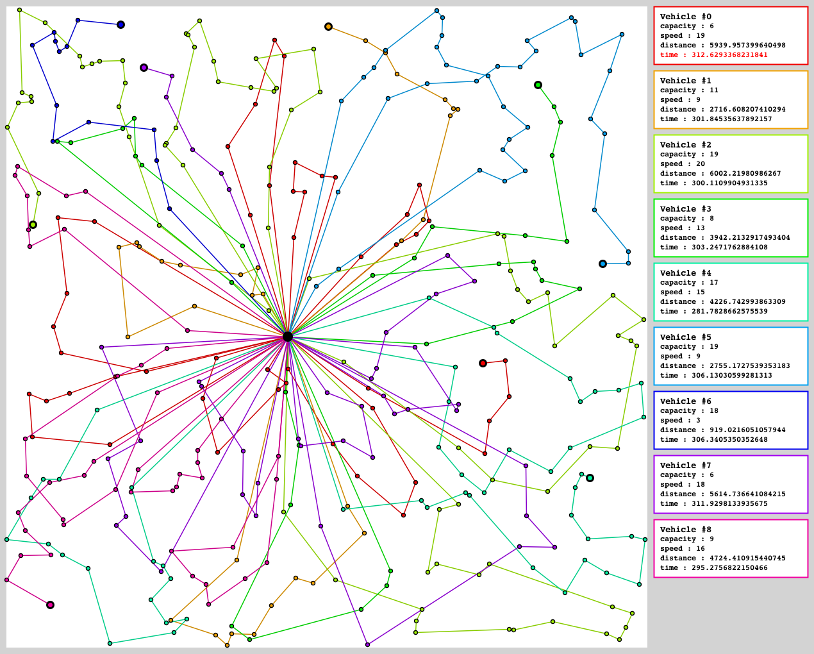
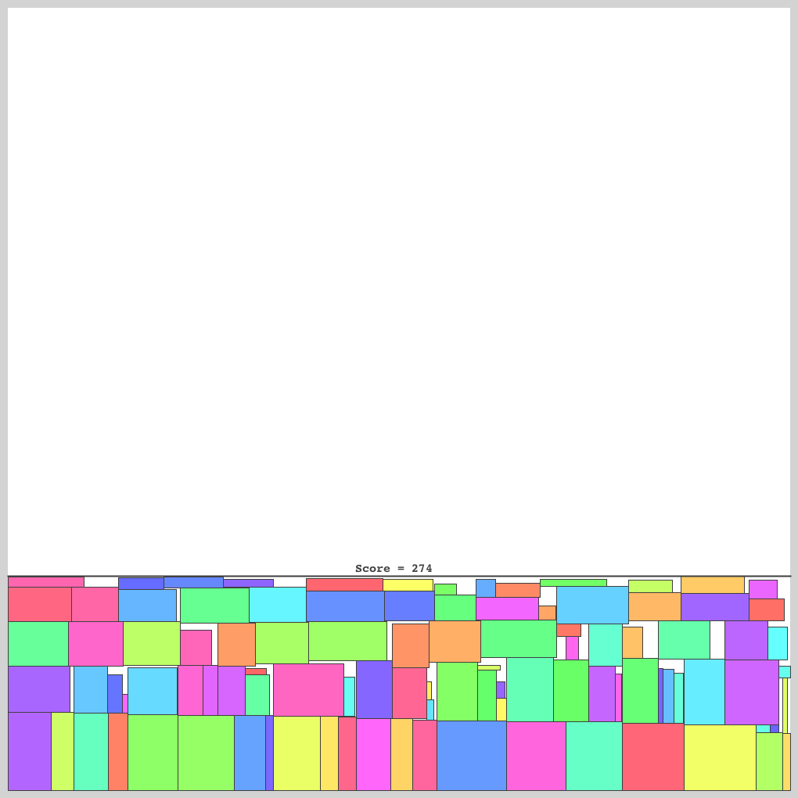
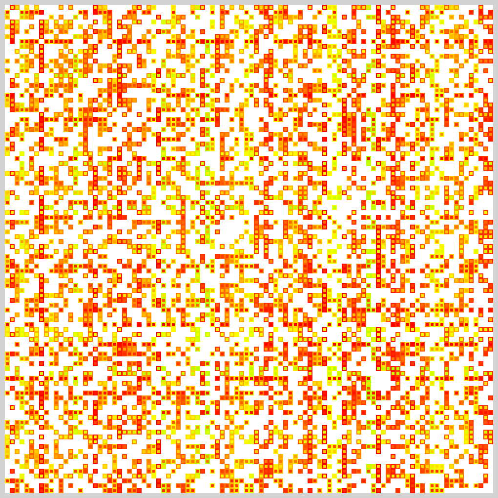
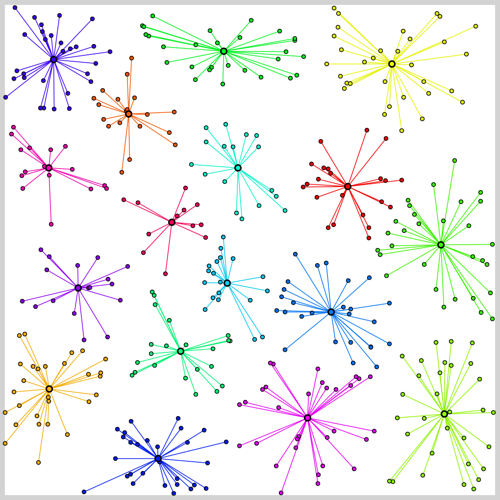
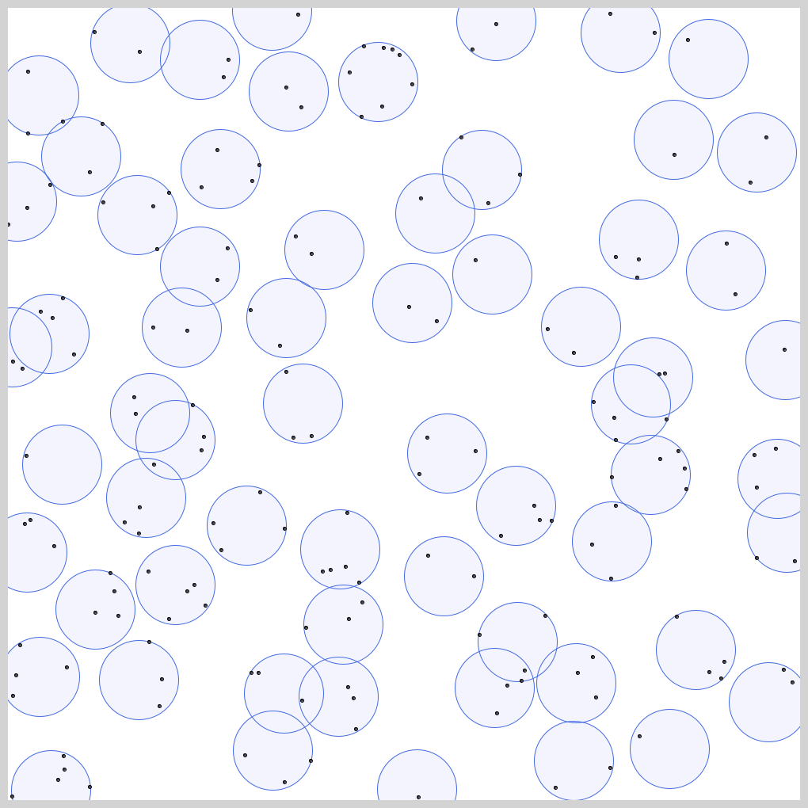
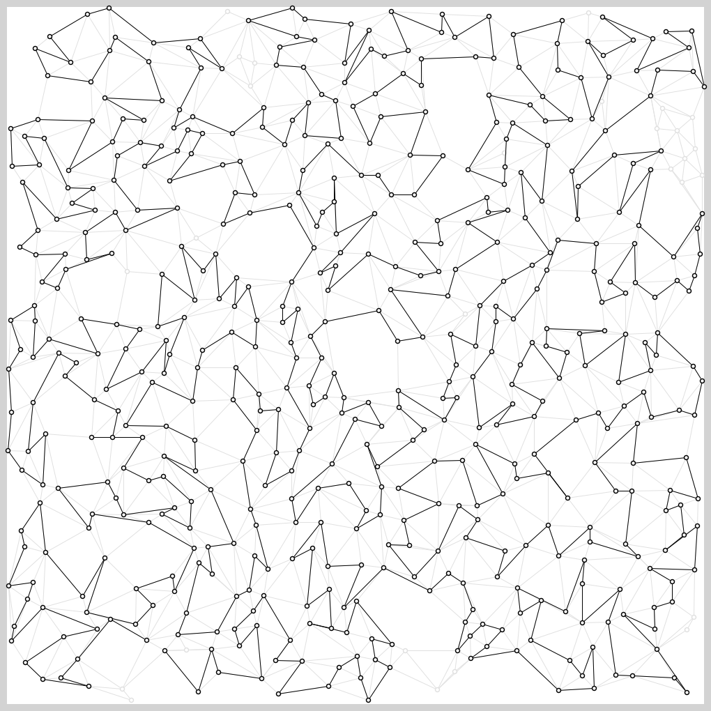
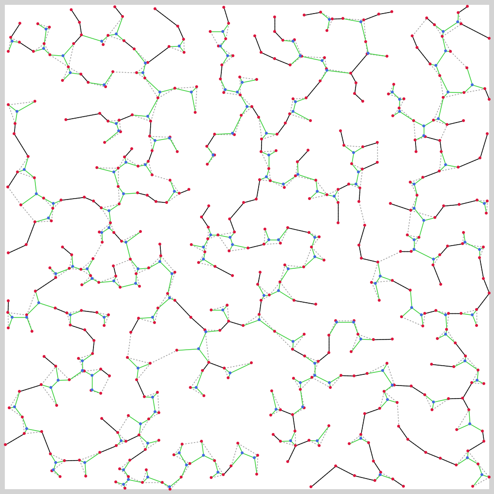
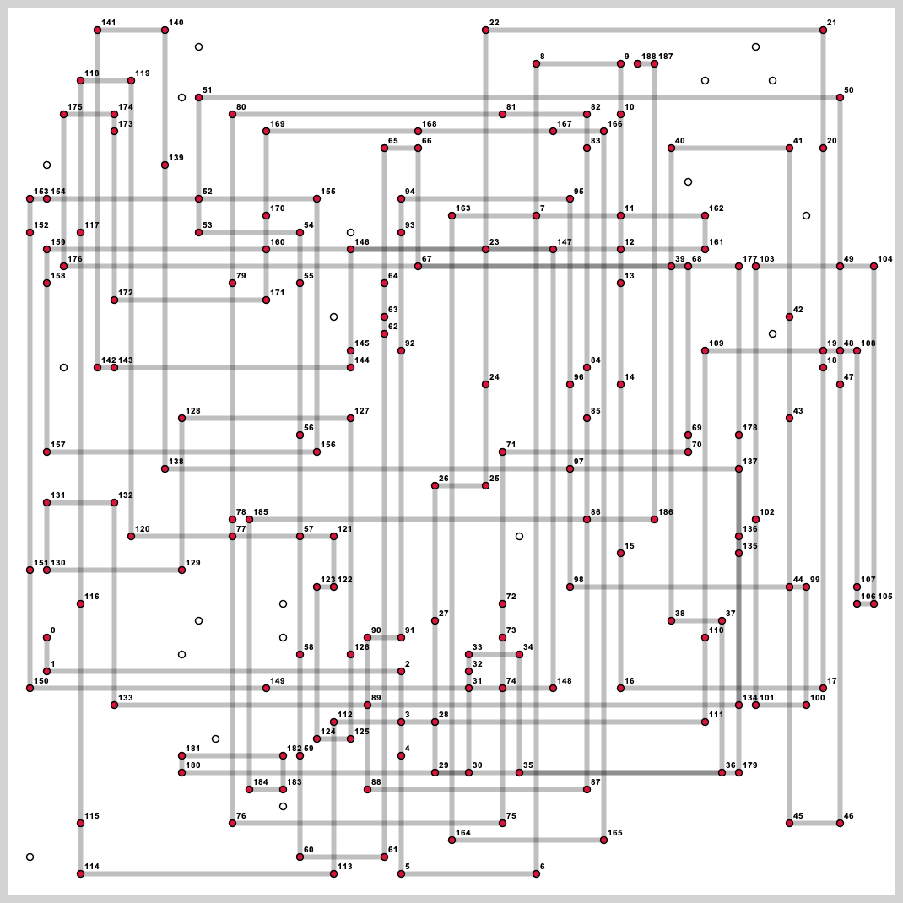

# mm-tester 

## 環境

### Ubuntu
1. apt
```
$ sudo apt update
$ sudo apt install default-jre default-jdk build-essential git curl python3
```
2. sdkman
```
$ curl -s http://get.sdkman.io | bash
$ source ~/.sdkman/bin/sdkman-init.sh
$ sdk install gradle
```

### macOS
1. [Xcode](https://apps.apple.com/jp/app/xcode/id497799835?mt=12)とCommand Line Tools
```
$ xcode-select --install
```
2. [Homebrew](https://brew.sh)
```
$ brew update
$ brew cask install java
$ brew install git gradle python3
```

### Docker
```
$ git clone --depth 1 https://github.com/kosakkun/mm-tester.git
$ cd mm-tester
$ docker build . -t mm-env
$ docker run --rm -v $(pwd):/mnt/workdir -w /mnt/workdir -it mm-env /bin/bash
```

## 使い方

### テスタのビルド
```
$ git clone --depth 1 https://github.com/kosakkun/mm-tester.git
$ cd mm-tester
$ gradle build
```

### サンプル
例）Traveling Salesmanのjavaのサンプルを実行する場合．
```
$ cd TravelingSalesman/sample/java
$ chmod +x run.sh
$ ./run.sh
```

### 問題文が読めない時
[ここ](http://marxi.co)とかに貼り付けて読んでください．

### 問題毎のファイル構成
```
.
├── README.md
├── build.gradle
├── build
│   └── libs
│       └── Tester.jar
├── tester
│   └── *.java
└── sample
    ├── cpp
    │   ├── run.sh
    │   └── main.cpp
    ├── java
    │   ├── run.sh
    │   └── Main.java
    └── python
        ├── run.sh
        └── main.py
```

## 問題
### [Traveling Salesman](TravelingSalesman/)


### [Vehicle Routing](VehicleRouting/) 


### [Rectangle Packing](RectanglePacking/)


### [Graph Coloring](GraphColoring/)


### [Clustering](Clustering/)


### [Sliding Puzzle](SlidingPuzzle)


### [Rectilinear Steiner Tree](RectilinearSteinerTree/)


### [Disk Covering](DiskCovering/)


### [Longest Path](LongestPath/)


### [Euclidean Steiner Tree](EuclideanSteinerTree/)


### [Hiroimono](Hiroimono/)



## License
- mm-tester - [MIT License](https://github.com/kosakkun/mm-tester/blob/master/LICENSE)
- This software includes the work that is distributed in the [Apache License 2.0.](http://www.apache.org/licenses/LICENSE-2.0)
  - [Jackson Databind](https://github.com/FasterXML/jackson-databind)
  - [Apache Commons CLI](https://commons.apache.org/proper/commons-cli/)
  - [Spring Boot](https://spring.io/projects/spring-boot)
