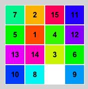

<h2>Sliding Puzzle</h2>

<h3>問題文</h3>
$15$パズルを知ってますか？あれを$N×N$の盤面でより短い手数で解いてください．
   

<h3>制約</h3>
<ul>
<li>$4 \leqq N \leqq 10$</li>
</ul>

<h4>入力</h4>
盤面の大きさ$N$とボードの状態$B$が与えられます．$B_{i,j}$には$1$から$N^2-1$の数字と，空白を表す$-1$がそれぞれ割り当てられます．初期状態から$100000$回ランダムシャッフルして盤面を生成します．入力として与えられるシャッフルされた盤面は必ず揃えることができます．

$N$ 
$B_{0,0} \ B_{0,1} \ \cdots \ B_{0,N-1}$ 
$B_{1,0} \ B_{1,1} \ \cdots \ B_{1,N-1}$ 
$\vdots$ 
$B_{N-1,0} \ B_{N-1,1} \ \cdots \ B_{N-1,N-1}$ 

<h4>出力</h4>
盤面の数字を$B_{0,0} \ \rightarrow \ B_{0,1}  \ \rightarrow \ \cdots \ \rightarrow \ B_{N-1,N-2} \ \rightarrow \ B_{N-1,N-1}$の順番に$1$から$N^2-1$と$-1$がこの順に並ぶように並び替えるための手順を出力してください．始めに手順の数$M(0 \leqq M \leqq 100000)$を出力して，続く$M$行に移動させるパネルの座標$(r_{i},c_{i})$を出力してください．左上の座標を$(0,0)$，右下の座標を$(N-1,N-1)$とします．空白と動かすパネルは隣り合っている必要はない(複数のパネルを一緒にスライドできる)ですが，パネルが動かせない場合やパネルが無い座標，範囲外の座標が指定された場合，その操作は無視されます．

$M$ 
$r_{0} \ c_{0}$ 
$r_{1} \ c_{1}$ 
$\vdots$ 
$r_{M - 1} \ c_{M - 1}$ 

<h5>入力の盤面の例</h5>
<pre>
 4 12  3  1
 5 14 11  8
-1 10  7  2
13  6 15  9
</pre>

<h5>並び替えた後の盤面</h5>
<pre>
 1  2  3  4
 5  6  7  8
 9 10 11 12
13 14 15 -1
</pre>

<h3>スコア</h3>
出力の手順に従ってパズルを解きます．最終的な盤面の各パネルの正しい位置からのマンハッタン距離の和$dist$，手順の操作回数を$count$として，$(dist × 100000) + count$をスコアとします．

<h3>テスタ</h3>
TopCoder の Marathon Match と同じです．<code>"[command]"</code>にプログラムの実行コマンド，<code>[seed]</code>に乱数のシードを入れてください．

<pre>
$ java -jar Tester.jar --exec "[command]" --seed [seed]
</pre>

<h4>その他オプション</h4>
<pre>
usage: Tester.jar
 -d,--debug            write the input and output of [command] as a text file.
 -e,--exec [command]   set the execution command of the solver. (required)
 -h,--help             print this message.
 -l,--delay [ms]       frame delay time [ms].
 -o,--save             output gif animation.
 -s,--seed [seed]      set a random seed. (required)
 -v,--vis              visualize the result.
</pre>
